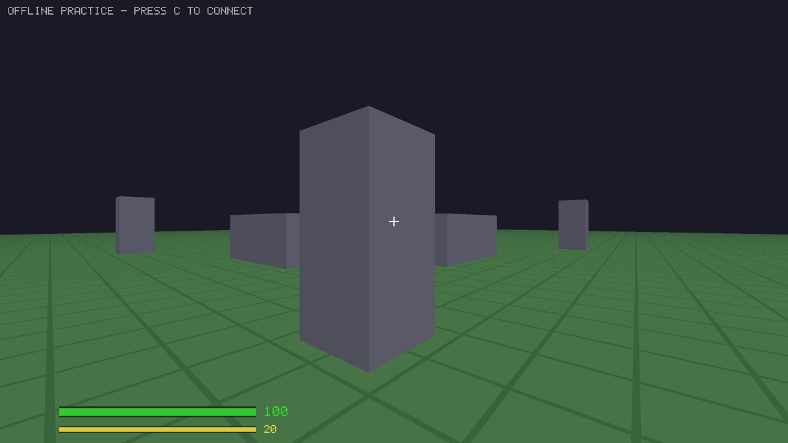

# PvP Shooter

Barebones 3D first-person free-for-all shooter, built from scratch in C++17.
No game engine, no physics library, no networking library — just SDL2, OpenGL 3.3, GLM, and raw UDP sockets.

Up to 16 players drop in and out of a dedicated server and fight across a walled warehouse yard full of shipping containers, crates, and a central building. Move with sprint, jump, and crouch; aim down sights for accurate fire or shoot from the hip with movement spread, and respawn after 3 seconds at a random spawn point.

Two weapons — a 9mm **Uzi** SMG and a **Glock 19** pistol — fire real projectiles with true muzzle velocity (~375–400 m/s), bullet drop, air drag, and distance damage falloff. Collision is swept per bullet, so fast rounds stop dead on cover instead of tunnelling through it. Recoil is sticky: the gun climbs as you spray and stays where it ended — you pull it back down yourself. Switch weapons with the number keys or the scroll wheel — each gun keeps its own magazine and reserve, so swapping isn't a free reload. The mag reloads automatically when it runs dry, or reload early with R. Lean around cover with Q/E to peek without exposing your body.

Launching the client alone drops you into an offline **training** arena (practice range + dummy); connect to a server and you spawn into the **warehouse** match map — or a 1 km² open **field** map with procedurally generated rolling terrain and scattered cover when the server runs `FPS_MAP=field`.



## Build

Requires CMake 3.20+ and SDL2.

```bash
# macOS
brew install cmake sdl2

# Ubuntu/Debian
sudo apt install cmake build-essential libsdl2-dev libgl1-mesa-dev

# Windows
# Nope, I won't touch that even with a 20-inch stick.

# then
cmake -B build
cmake --build build
```

Produces two binaries: `build/game` (client) and `build/server` (dedicated server).

## Run

```bash
# terminal 1 — start the server (UDP port 7777)
./build/server

# one terminal per player (up to 16)
./build/game 127.0.0.1
```

For multiple machines, run the server anywhere reachable and pass its IP to each client.

To play the large open-terrain map instead of the warehouse, launch the **server**
with `FPS_MAP=field`. Clients auto-detect the server's map on connect (it's sent in
the join handshake) — no flag needed on the client:

```bash
FPS_MAP=field ./build/server
./build/game 127.0.0.1          # adopts whatever map the server runs
```

### Running several maps on one host

Each server process serves one map. Run several side by side on distinct ports with
`FPS_PORT` (default `7777`); the client lobby scans `7777`–`7784` on the host you enter:

```bash
FPS_PORT=7777 FPS_MAP=field     ./build/server
FPS_PORT=7778 FPS_MAP=warehouse ./build/server
FPS_PORT=7779 FPS_MAP=training  ./build/server
```

Starting `./build/game` with no IP launches **training mode** — an offline practice arena with a shooting range and a respawning dummy. Press **C** in-game to type a host address, then **Enter** to scan it for running games: a server browser lists every map found with its map name, player count, and ping. Use **Up/Down** to pick one and **Enter** to join (**Esc** cancels). You can switch servers any time without restarting.

### Testing netcode (lag, jitter, packet loss)

The client can simulate a bad connection so you can test lag compensation and the
interpolation buffer on a single machine. Set any combination of these environment
variables on the client; they apply to packets in both directions:

| Variable     | Meaning                                  | Example       |
| ------------ | ---------------------------------------- | ------------- |
| `FPS_LAG`    | One-way latency, milliseconds            | `FPS_LAG=150` |
| `FPS_JITTER` | Random ±delay added per packet, ms       | `FPS_JITTER=40` |
| `FPS_LOSS`   | Packet drop chance, percent (0–95)       | `FPS_LOSS=10` |

```bash
# terminal 1
./build/server

# terminal 2 — 150 ms one-way (300 ms RTT), ±40 ms jitter, 10% loss
FPS_LAG=150 FPS_JITTER=40 FPS_LOSS=10 ./build/game 127.0.0.1
```

- **Lag compensation:** the server rewinds player positions to the moment you fired, so strafing a target and firing on the crosshair still registers despite the delay.
- **Interpolation buffer:** remote players render a couple of snapshots behind the newest packet, so jitter and the occasional dropped packet stay smooth instead of stuttering or snapping.

Without these variables (or on a LAN) there's effectively no delay, so behavior is unchanged.

## Controls

| Input        | Action                            |
| ------------ | --------------------------------- |
| W A S D      | Move                              |
| Shift        | Sprint                            |
| Space        | Jump                              |
| Left Ctrl    | Crouch                            |
| Q / E        | Lean left / right (peek)          |
| Mouse        | Look                              |
| Left click   | Shoot                             |
| Right mouse  | Aim down sights (zoom)            |
| 1 / 2        | Select weapon (Uzi / Glock 19)    |
| Scroll wheel | Cycle weapon                      |
| B            | Cycle fire mode (Uzi: semi/burst/auto; Glock is semi-only) |
| R            | Reload                            |
| Tab (hold)   | Scoreboard                        |
| G            | Clear range marks (offline)       |
| C            | Connect — host prompt, then server browser |
| M            | Toggle full-screen map            |
| J            | Toggle HUD on / off (immersion)   |
| F            | Toggle wireframe                  |
| ESC          | Quit                              |

HP, ammo, and the current weapon show on screen, kills appear in the feed top-right, and holding Tab shows the scoreboard. Press **J** to hide the entire HUD for a clean, immersive view; press again to restore it.
