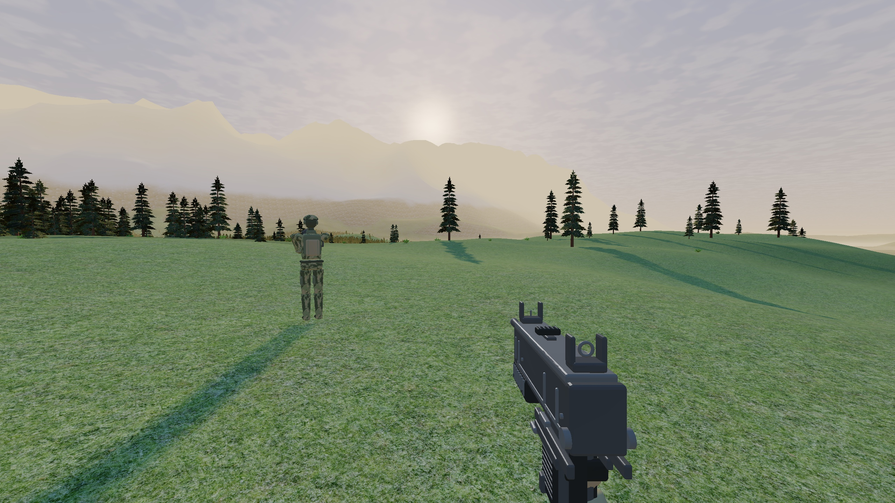

# AI PvP FPS

An online first-person shooter built from scratch in **C++17**, using SDL2, OpenGL and raw UDP. No game engine.

**16-player free-for-all** across Paldiski, a 2×2 km Baltic landscape. Dedicated authoritative server, projectile ballistics, Uzi and Glock, aiming, sprinting, crouching and leaning.



[50-second in-game preview](docs/assets/gameplay-preview.mp4) · Silent, scripted capture from the game.

## Build and play

Requires CMake 3.20+, a C++17 compiler, SDL2 and OpenGL. On macOS: `brew install cmake sdl2`.

```sh
cmake -B build -DCMAKE_BUILD_TYPE=Release
cmake --build build --config Release
./build/game                         # offline practice
```

For multiplayer, start a server and connect using its IP:

```sh
./build/server                      # UDP port 7777
./build/game 127.0.0.1
```

You can also press **C** in-game to find and join a server. Multi-config builds place binaries under `build/Release/`.

## Controls

**WASD** move · **Mouse** look · **Left click** fire · **Right click** aim<br>
**Shift** sprint · **Space** jump · **Ctrl** crouch · **Q/E** lean<br>
**1/2** weapon · **R** reload · **Tab** scoreboard · **Esc** quit

[Roadmap](TODO.md) · [Development notes](docs/development.md) · [Contributing](AGENTS.md)
