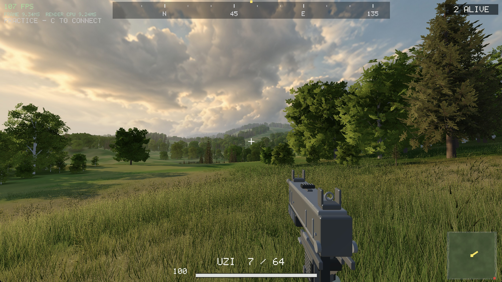

# AI PvP FPS

[](https://github.com/taavisaft/ai-pvp-fps/releases/download/v0.1.1/ai-pvp-fps-0.1.1-macos-arm64.zip)

**v0.1.1 · Apple Silicon Macs only.** Extract the ZIP and open **AI PvP FPS.app**. If macOS blocks this unnotarized build, use **System Settings → Privacy & Security → Open Anyway** after attempting to open it. [Release notes](https://github.com/taavisaft/ai-pvp-fps/releases/tag/v0.1.1).

An online first-person shooter built from scratch in **C++17**, using SDL2, OpenGL and raw UDP. No game engine.

**16-player free-for-all** across Paldiski, a 2×2 km Baltic landscape. Fight with the Uzi, Glock 19, and scoped Kar98k, projectile ballistics, and an authoritative dedicated server. Players have **100 HP** and respawn after **3 seconds**. Practice offline or join an online match.



[50-second in-game preview](docs/assets/gameplay-preview.mp4) · Silent, scripted capture from the game.

## Build and play

Requires CMake 3.20+, a C++17 compiler, SDL2 and OpenGL. On macOS: `brew install cmake sdl2`.

```sh
cmake -B build -DCMAKE_BUILD_TYPE=Release
cmake --build build --config Release
./build/game                         # offline practice
FPS_RUNNERS=1 ./build/game           # you + 15 random runners (16 players total)
```

For multiplayer, start a server and connect using its IP:

```sh
./build/server                      # UDP port 7777
./build/game 127.0.0.1
```

Walk Paldiski offline with `FPS_MAP=paldiski ./build/game`. `FPS_NOMEADOW=1` disables grass for performance comparisons.

Offline practice spawns in a 2×2 km training landscape: shooting range at the origin, meadow, pond and wooded hills to the north.

```sh
FPS_REF=meadow ./build/game          # fixed cameras: meadow|pond|canopy|range (training), shore|bog|forest|ridge|golden (Paldiski)
FPS_NOREFLECT=1 ./build/game         # pond mirror off, for comparisons
FPS_BENCH_ROUTE=build/traversal.csv FPS_QUALITY=medium ./build/game
# Native-resolution scripted pond approach, quick turns, forest traversal and scope cycles.
# Writes per-frame CSV and prints p50/p95/p99/max; exits after all four scenarios.
# FPS_BENCH_GPU=1 enables diagnostic GPU queries (substantial overhead on some drivers).
```

You can also press **C** in-game to find and join a server. Multi-config builds place binaries under `build/Release/`.

On macOS, the game starts in desktop fullscreen at the display's native Retina
resolution. Press **Option+Return** to switch between fullscreen and the 1280×720
window. Set `FPS_WINDOWED=1` to start windowed (useful for fixed-resolution benchmarks).

## Controls

| Key | Action |
| --- | --- |
| WASD / Mouse | Move / look |
| Shift / Space | Sprint / jump |
| Left Ctrl | Crouch |
| Q / E | Lean left / right |
| Left / right click | Fire / aim down sights |
| 1 / 2 / 3 | Uzi / Glock 19 / Kar98k (8× scope on right click) |
| Scroll wheel | Cycle weapon |
| R | Reload |
| B | Cycle fire mode (Uzi: semi/burst/auto) |
| Tab (hold) | Scoreboard |
| C | Find and join a server |
| M / J | Toggle map / HUD |
| Option+Return | Toggle fullscreen |
| K | Cycle atmosphere |
| V | Toggle third-person view |
| G | Clear bullet marks (offline) |
| H / F | Toggle hitboxes / wireframe (debug) |
| F6 | Toggle 15 roaming practice players (offline only) |
| Esc | Settings / resume (mouse and ADS sensitivity, invert Y, fullscreen, quit) |

[Roadmap](TODO.md) · [Development notes](docs/development.md) · [Contributing](AGENTS.md)

Aim settings are saved locally when you close the settings menu. Use arrow keys or click the rows; the match continues while the menu is open.
