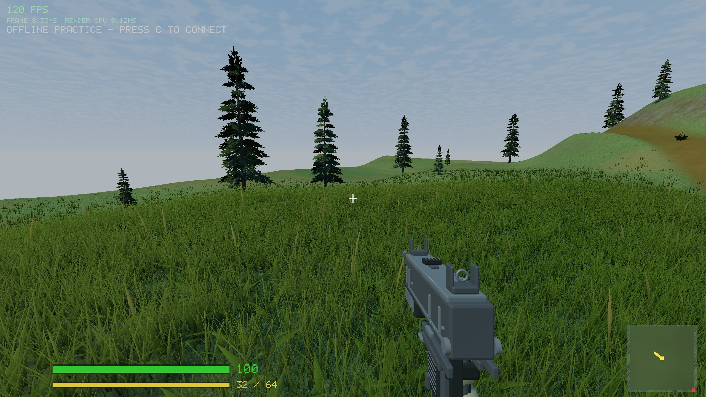

# Dense lobby meadow — 2026-09-05

A 20 × 20 m patch centered at (0,30) explores the user's dense meadow reference. It contains 11,481 mixed plants over 16 five-metre tiles, feathered into the earlier lobby grass. Paldiski remains unchanged.



## Appearance and implementation

The new procedural plant mesh uses folded, curved grass ribbons, occasional broad leaves and rare dry seed heads. Each instance varies rotation, scale, tint and which secondary plants are visible. These are geometric assets, not scanned plants or new texture atlases. Existing lobby materials provide the underlying ground, darkened subtly beneath the dense patch.

Plants cast nearby shadows and receive world shadows. The depth shader mirrors the plant variants, wind and range scaling used by the visible pass. Tiles are culled and plants shrink toward the 38 m range boundary. All instances are uploaded on lobby initialization; no meadow buffers are generated while walking. This patch still needs cheaper distant geometry and further art review before wider use.

The first version used more blade segments. Reducing segments and lessening seed-head frequency improved cost and appearance. Original surrounding grass is excluded smoothly from the patch instead of being drawn underneath it.

Custom `FPS_POS` benchmark/capture cameras are now locked against mouse/focus input, as named reference cameras already were. Earlier custom-camera measurements should be treated as indicative because this protection was missing.

## Validation

- Client and headless server built in default and Release configurations; all six CTest suites passed in each, including localhost UDP tests.
- Patch-mask boundary checks added to the lobby terrain suite. Existing movement checks traverse the meadow area; grass remains cosmetic and does not block movement/bullets.
- In-game captures inspected dense coverage, the boundary, broad leaves and seed heads. Existing texture-unit warning remains.
- GPU timer queries are optional, use a four-query pool per pass, and read only available results. No waits for query completion. Enable with `FPS_MEADOW_GPU=1`.

## Measurements

Local Release, medium, 2560 × 1440, fixed position (5,27), yaw 145°, pitch -10°, default atmosphere. Each frame benchmark discards 300 warm-up frames and collects 600 samples. `FPS_NOMEADOW=1` restores the earlier grass distribution for comparison; the ground material is identical in both runs.

| Frame time, GPU timer disabled | Earlier grass | Dense meadow |
| --- | ---: | ---: |
| Mean | 5.66 ms | 8.28 ms |
| Median | 5.59 ms | 8.28 ms |
| p95 | 7.66 ms | 10.98 ms |
| Worst | 94.08 ms | 23.56 ms |

The baseline had an isolated large hitch; the median confirms a roughly 2.7 ms cost increase. These are single local samples, not a traversal or low-end hardware guarantee.

A separate instrumented run measured the meadow's GPU means over 596 delayed samples after warm-up: **3.733 ms lit**, **0.565 ms shadow**. The instrumented run's total frame mean was 13.64 ms, substantially above the normal run, so timer-enabled frame times must not be compared directly against the uninstrumented baseline. Keep timing disabled for normal play.

```sh
FPS_POS=5,27 FPS_YAW=145 FPS_PITCH=-10 FPS_QUALITY=medium ./build-release/game
```

Add `FPS_BENCH=1` for the fixed-camera benchmark. Add `FPS_NOMEADOW=1` to compare the earlier sparse grass. This is a bounded visual experiment; the cost does not justify a map-wide rollout yet.
