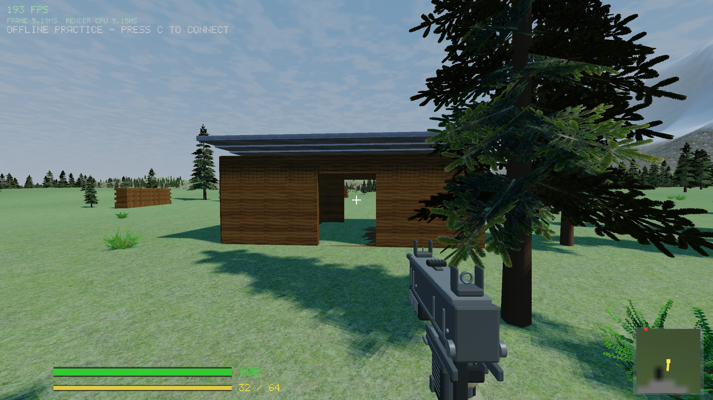

# Forestry combat site — first stage, 2026-09-05

The first small Paldiski layout occupies roughly 100 × 100 m around (325, 75). An 8 × 6 m timber shelter has two 1.8 m doorways, side windows, a shallow metal roof and a workbench. Eight staggered stacks of sawn timber provide cover at different heights and leave routes around the shelter. The first join/practice spawn is nearby at (305, 93); other existing wide-map spawns remain.



This is the playable layout stage. Natural rock meshes, ground/litter variation, understory refinement and multiplayer spawn balancing remain. A two-player sightline playtest has not been performed.

## Implementation and checks

- Uses existing shared boxes and wood/metal materials for identical visible and solid geometry, including shadows. No new renderer subsystem or game-loop allocations.
- A single terrain pad levels the shelter footprint and blends into the surrounding terrain. Timber foundations are buried to the lowest sampled corner; stack tops clear the highest corner.
- Deterministic tree/bush exclusions keep the shelter, timber stacks, door approaches and first spawn clear. World revision is now `0x20260905`; incompatible old worlds are rejected. Packet layout remains v4.
- Client and headless server built in default and Release configurations. All five CTest suites passed in both, including localhost UDP firing tests.
- New headless checks exercise movement through both doors, wall blocking, shooting lines through windows/doors, roof/sill collision, first-spawn clearance, tree exclusions and repeat generation after lobby switching.
- Inspected the layout and entrance in the running game. Existing texture-unit warning remains.

## Local Release comparison

Both runs: 2560 × 1440, medium quality, position (305, 93), yaw -42°, pitch -3°, default atmosphere, 300 warm-up frames then 600 samples. Baseline uses the current tree collision work with the forestry generator omitted; no compilation or second game ran during either measured run.

| Measurement | Before site | With site |
| --- | ---: | ---: |
| Average frame | 5.44 ms | 5.24 ms |
| Median frame | 5.54 ms | 5.25 ms |
| p95 frame | 7.78 ms | 7.46 ms |
| Worst frame | 8.35 ms | 8.32 ms |
| Shadow submission/wait | 0.13 ms | 0.25 ms |
| World submission/wait | 0.30 ms | 0.50 ms |

Rendering submission increased as expected. Overall frame time showed no regression in this single local sample; it does not establish an improvement, GPU pass cost, traversal hitch behavior or 16-player performance.

Reproduce the current run:

```sh
FPS_MAP=paldiski FPS_POS=305,93 FPS_YAW=-42 FPS_PITCH=-3 FPS_QUALITY=medium FPS_BENCH=1 ./build-release/game
```
