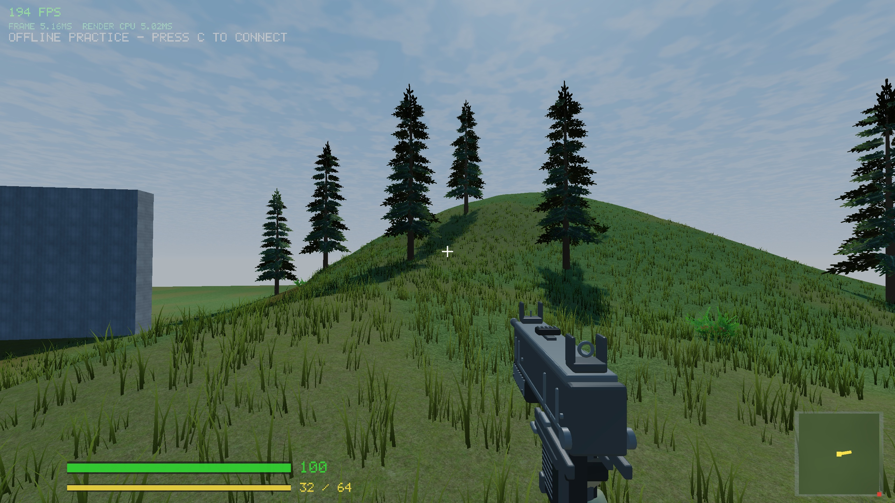

# Lobby terrain and grass trial — 2026-09-05

Existing tree-cover and forestry-site work was committed first as `9505aca` (`feat: add tree cover and forestry combat site`). This experiment is intentionally confined to the offline lobby; it has not been promoted to Paldiski.



## Changes

- Low meadow hummocks and fine surface variation outside the established shooting/prop pad. Lobby terrain now uses a half-metre grid, built on map initialization.
- Dedicated lobby material blends the existing ground, photographic forest floor, dirt and rock textures at different scales, with quieter greens, a worn range and a curved footpath. Fine shading relief fades with distance. This reuses existing assets rather than introducing new scanned/PBR texture sets.
- Seven curved blades per tuft, varied scale and dry tint, root shading, wind and simple transmitted light. Corrected blade lighting when looking uphill.
- 95,641 tufts across 64 static tiles, uploaded once on lobby initialization. Range is 38 m, with sinking/fading near the edge and tile frustum culling. Grass avoids the worn path, range and prop footprints. No grass tile generation or staging-buffer growth during lobby traversal.
- Grass geometry and tile handling moved into focused source files. Paldiski grass stays disabled; its material branch, terrain and deterministic placement are unchanged. The lobby is offline, so the online world revision remains unchanged.

## Verification and cost

Client and headless server built in default and Release configurations. All six CTest suites passed in each, including localhost UDP tests. New checks cover range height, meadow variation, sampled mesh/collision agreement, traversal and preserved Paldiski height samples from the preceding commit. In-game captures inspected the worn path and a meadow slope. The existing texture-unit warning remains.

Controlled local comparison: Release, 2560 × 1440, medium quality, position (5,17), yaw 110°, pitch -8°, default atmosphere; 300 warm-up frames followed by 600 samples. Baseline was captured before changing shaders or geometry.

| Frame time | Before | Lobby trial |
| --- | ---: | ---: |
| Mean | 3.23 ms | 4.11 ms |
| Median | 3.17 ms | 3.96 ms |
| p95 | 6.45 ms | 8.02 ms |
| Worst | 9.53 ms | 11.01 ms |

Mean cost increased by 0.88 ms in this single local sample. This is frame time, not isolated GPU timing or a full traversal benchmark. The grass has no individual cast shadows; it receives world shadows and uses root shading. Density/colour and the distance transition need user review before any online rollout.

To inspect the trial:

```sh
FPS_POS=5,27 FPS_YAW=145 FPS_PITCH=-10 ./build-release/game
```

Follow-up: the [dense patch](dense-meadow-2026-09-05.md) adds coverage and shadows. That pass also fixed custom-camera locking; the earlier figures above are indicative because mouse/focus events could alter custom views.
