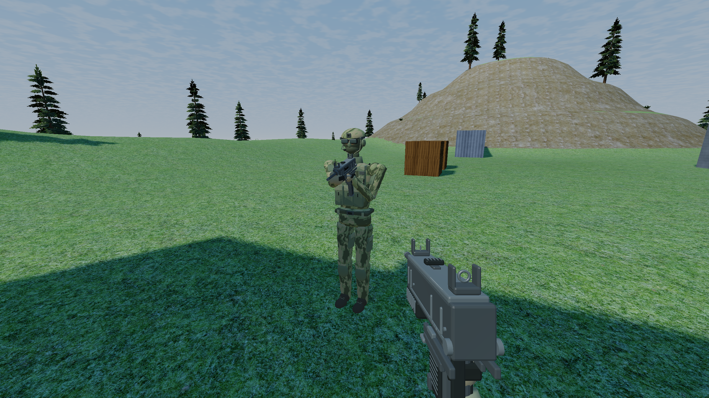

# Soldier and Uzi visual pass — 2026-09-05

Replaced the generic segmented player geometry and cube Uzi with original Blender-authored assets. The soldier has a helmet, goggles, balaclava/headset, field clothing, plate carrier, webbing/pouches, gloves, and boots. The Uzi has a recognizable classic exterior, separate surface colors, beveled edges, iron sights, open muzzle/aperture/trigger guard, ribbed grips, magazine, and folded stock.

The client uses the same Uzi asset in first and third person. `player_visual.cpp` now owns character/viewmodel drawing, reducing the oversized main file. First-person gloves/sleeves reuse the soldier assets. The Uzi firing grip matches the existing shared anchor; its aperture and front post share the ADS centerline. Weapon selection is passed explicitly into the viewmodel. Rendering corrects reflected cosmetic limb frames and first-person winding without changing the shared gameplay hit volumes.

Vertex data carries normals, linear albedo and specular strength. Camouflage and restrained, filtered fabric variation use stable local coordinates. Authored lighting is encoded separately from the older display-valued terrain path, converging to the same fog color. This is not a full PBR/sRGB renderer conversion.

Full assets use 38,488 triangles per soldier with Uzi. Beyond 15 meters they use 9,508, a 75.3% reduction combined (the body alone drops 75.3%). Full and reduced buffers together occupy 2,909,320 bytes, shared by all players. Buffers upload at startup; no model generation or mesh allocation was added to the frame loop. Body segments retain individual draws and the Uzi takes one draw. Both world and shadow passes choose distance detail; first person always uses full geometry.

Editable source, provenance, commands and limitations: [asset guide](../tools/soldier/README.md). All meshes are original; the [Small Arms Survey / Royal Armouries sheet](https://www.smallarmssurvey.org/sites/default/files/SAS_weapons-sub-machine-guns-Uzi.pdf) supplied a visual identification reference only. No external mesh/texture dependencies were added.

## Verification

- Built game and headless server in default and Release configurations.
- All three CTest suites passed in both configurations: server firing, client fire epochs, localhost UDP integration.
- Blender 5.2 generated the editable scene and previews. Exporting that saved scene through `export.py` reproduced all four generated headers byte for byte.
- Validated all 22 meshes for finite values, unit normals, triangle-aligned indices and index bounds.
- Inspected OpenGL captures at 2560×1440: hip-held Uzi, settled ADS, standing soldier, crouch with lean, and existing Glock ADS. The 300-frame captures allow transitions to settle; the shot log records weapon/ADS/crouch state.
- `git diff --check` passed.

## Performance observation

Same Mac, Release `-O3 -DNDEBUG`, medium quality, forest reference, 2560×1440 drawable, sequential runs. Each run skips 300 frames and records 600. The before executable was the previously built Release binary; after includes the new assets and rendering path.

| Frame duration | Before | After |
| --- | ---: | ---: |
| Mean | 5.55 ms | 5.20 ms |
| Median | 5.64 ms | 5.03 ms |
| p95 | 8.10 ms | 7.07 ms |
| Maximum | 8.38 ms | 8.38 ms |

Vegetation counts matched: 6 LOD0 trees, 954 LOD1 trees, 18,099 impostors and 71 bushes. Pass timings are CPU submission/wait, not GPU pass measurements. Earlier completed iterations measured 5.56–5.57 ms mean; the final run measured 5.20 ms. Treat the spread as run-to-run variation rather than a demonstrated optimization win. These short forest comparisons show no apparent regression in that scene; it is not a close-range 16-player, sustained traversal, network load, or cross-platform performance guarantee. The existing texture-unit warning still occurs.

## Remaining realism work

This is a playable art pass, with visibly segmented animation. A deforming skinned rig, better anatomical transitions and articulated hands, first-person support hand, reload/magazine/swap animations, and authored surface maps are still needed for the desired high realism. The magazine remains visually inserted during reload. Equipment is cosmetic; shared hitboxes, armor behavior, weapon statistics, physics, protocol, and map generation were not changed. Distance LOD uses a discrete transition; further character-heavy scenes are needed to tune its threshold.

